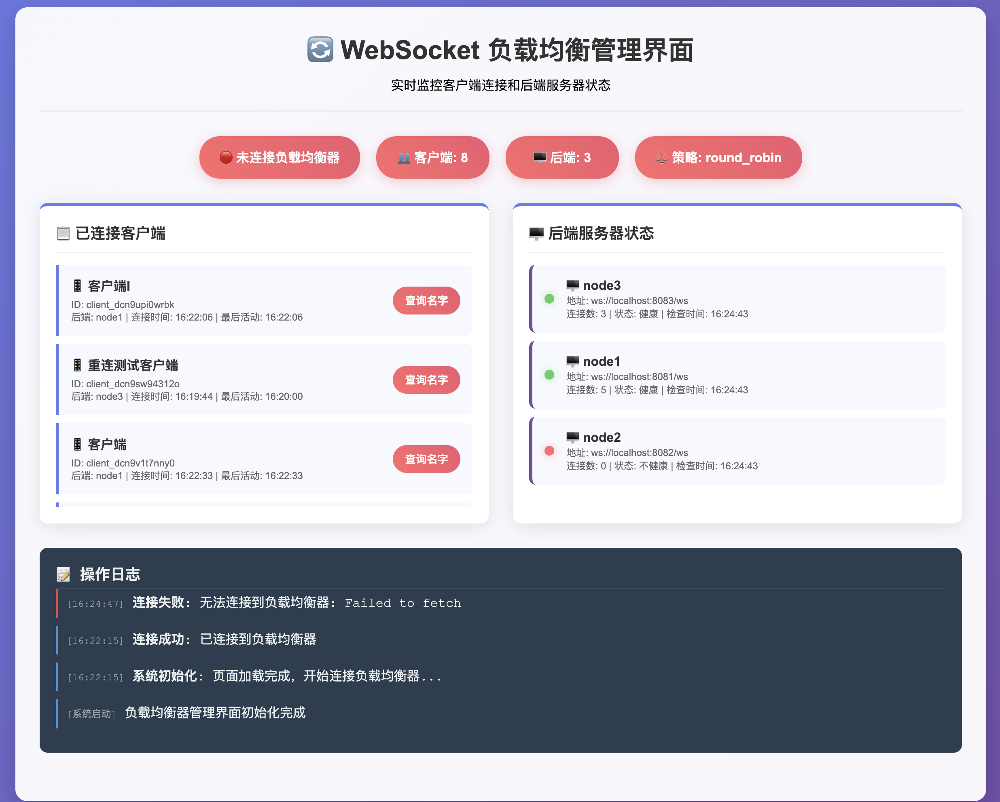

# 🚀 Go WebSocket Load Balancer

一个高性能、易用的 Go 语言实现的 WebSocket 负载均衡器系统，支持多客户端连接到多个后端服务器，具备故障转移、健康检查和 Web 管理界面等功能。

## ✨ 特性

- 🔄 **负载均衡**: 支持轮询(Round Robin)和最少连接(Least Connection)策略
- 🔧 **故障转移**: 自动检测后端服务器健康状态，故障时自动切换
- 🔁 **自动重连**: 客户端支持指数退避的自动重连机制
- 📊 **实时监控**: Web 管理界面实时显示系统状态
- 🌐 **REST API**: 提供完整的 REST API 接口
- 🐳 **Docker 支持**: 支持 Docker 容器化部署
- 📝 **详细文档**: 完整的文档和 API 参考

## 🏗️ 系统架构



```
多个客户端 ──→ 负载均衡器(8080) ──→ 多个服务端
    ↓                ↓                    ↓
  客户端A         Web管理界面          node1(8081)
  客户端B         API接口             node2(8082)
  客户端C         健康检查             node3(8083)
```

## 🚀 快速开始

### 1. 编译项目

```bash
go build -o websocket-system
```

### 2. 启动完整系统

```bash
./start-loadbalancer.sh
```

### 3. 启动客户端

```bash
./websocket-system -service=client -name=客户端A &
./websocket-system -service=client -name=客户端B &
```

### 4. 访问管理界面

打开浏览器访问: http://localhost:8080/web-loadbalancer.html

## 📊 端口配置

| 服务 | 端口 | 用途 |
|------|------|------|
| 负载均衡器 | 8080 | 客户端连接 + Web管理界面 |
| 后端服务器1 | 8081 | node1服务器 |
| 后端服务器2 | 8082 | node2服务器 |
| 后端服务器3 | 8083 | node3服务器 |

## 🔧 使用方式

### 负载均衡器
```bash
./websocket-system -service=loadbalancer -port=8080 -strategy=round_robin
```

### 后端服务器
```bash
./websocket-system -service=server -mode=single -port=8081 -node=node1
./websocket-system -service=server -mode=single -port=8082 -node=node2
./websocket-system -service=server -mode=single -port=8083 -node=node3
```

### 客户端
```bash
./websocket-system -service=client -name="我的客户端"
```

## 📡 API 接口

| 接口 | 方法 | 描述 |
|------|------|------|
| `/health` | GET | 健康检查 |
| `/api/clients` | GET | 获取客户端列表 |
| `/api/backends` | GET | 获取后端服务器状态 |
| `/api/query?client_id=xxx` | GET | 查询特定客户端 |

## 🧪 测试故障转移

```bash
# 1. 查看当前连接状态
curl -s http://localhost:8080/api/clients | python3 -m json.tool

# 2. 关闭一个后端服务器
lsof -ti:8081 | xargs kill

# 3. 等待健康检查生效（约10-15秒）
sleep 12

# 4. 查看系统自动故障转移
curl -s http://localhost:8080/api/backends | python3 -m json.tool
```

## 🐳 Docker 部署

```bash
# 构建镜像
docker-compose build

# 启动服务
docker-compose up -d
```

## 📚 文档

详细文档请查看 `docs/` 目录：

- [快速参考卡片](docs/quick-reference.md)
- [服务器管理指南](docs/server-management.md)
- [API接口文档](docs/api-reference.md)

## 🤝 贡献

欢迎提交 Issue 和 Pull Request！

## 📄 许可证

MIT License